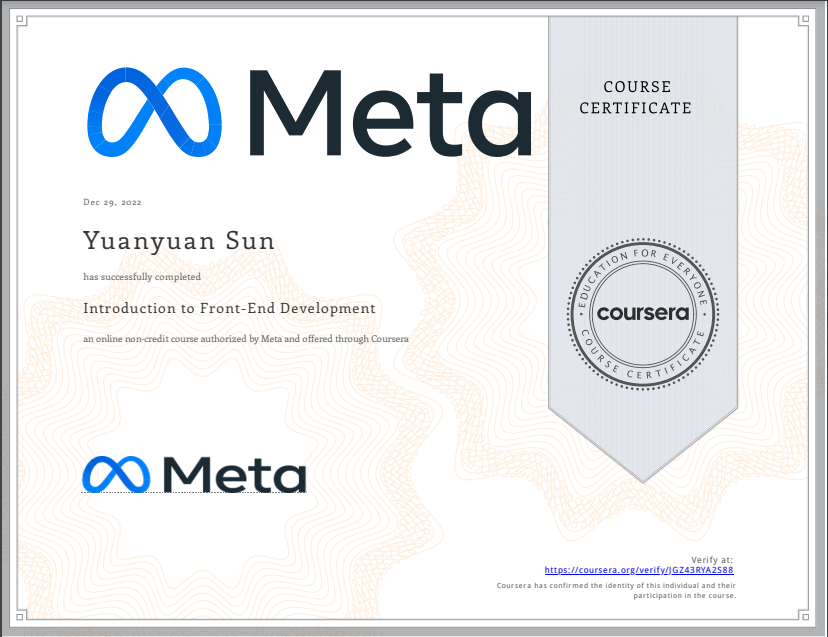

# Professional Certificate
Currently working on getting AWS Certified Solutions Architect

# Certificate of Course Completion
## [Introduction to Front-End Development (Meta)](https://coursera.org/share/7ebc7325faa3ed84f5e913b6be396005)

## [AWS Services for Solutions Architect Associate 2022](https://www.udemy.com/certificate/UC-ff5ba6a0-3338-4a16-83dd-a439778e85f7/)

## [Process Data from Dirty to Clean (Google)](https://www.coursera.org/account/accomplishments/verify/383VLF2WRJTF?utm_source=ln&utm_medium=certificate&utm_content=cert_image&utm_campaign=sharing_cta&utm_product=course)

